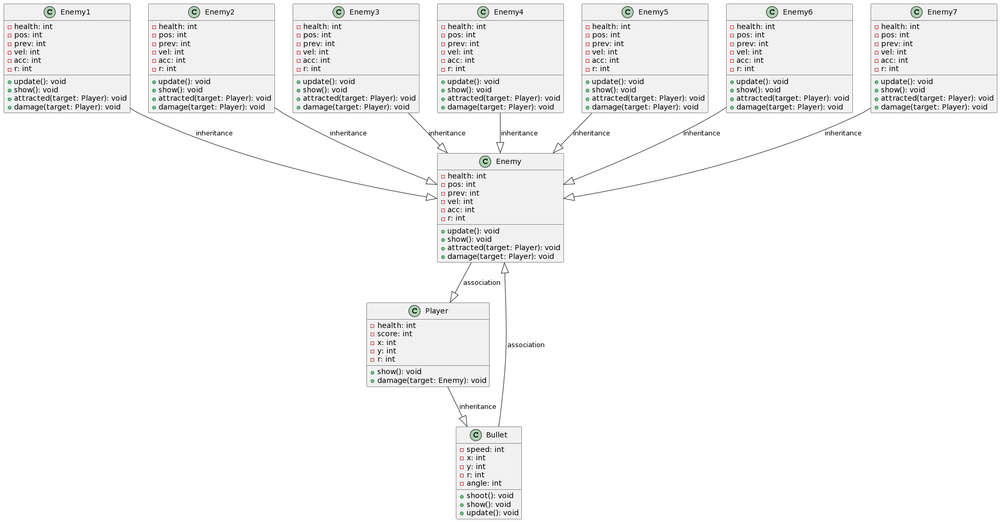
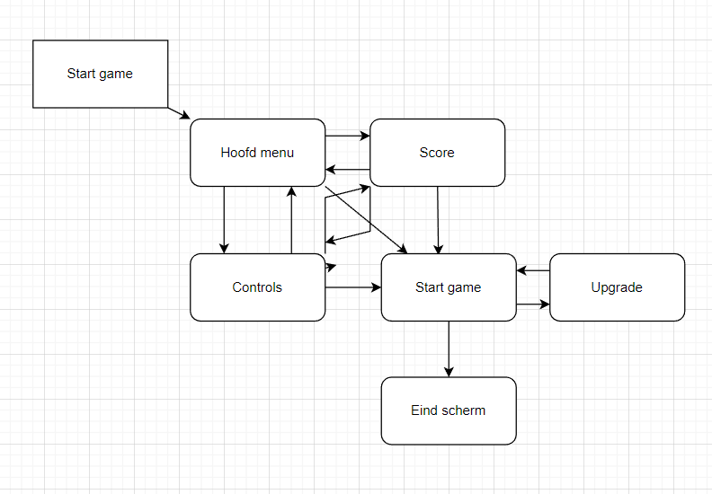

# Game Ontwerp
Om een duidelijk overzicht te krijgen van hoe onze game in elkaar zit heb ik twee diagrammen gemaakt om dit overzichtelijk te maken. Dit overzicht is belangerijk aangezien we kunnen kijken of dit de beste manier is om een game te ontwerpen en tegeerlijkertijd is het makkelijker om er iets aan toe te voegen. De twee methodes die we hebben gebruikt vind je hier onder


# Class diagram
Een class diagram is een diagram waarin je de veschillende classes in je game opschrijft en daaraan alles wat bij de class hoort toevoegt en dan de classes die bij elkaar horen linkt. 

Classes zijn een tool binnen de meeste codeertalen waaronder p5.js die het makkelijk maken om iets meerdere keren toe te voegen. Deze classes zijn dan dus de bouwstenen van je game en al heb je hiervan een duidelijk overzicht dan krijg je een goed beeld van hoe de game in elkaar zit. De diagram vind je hier:  


Om dit diagram te maken heb ik gebruik gemaakt van UML. Met deze taal kan je redelijk simpel classes aanmaken, waardes eraan toevoegen en de classes verbinden. Dit is de code hiervoor:
```
@startuml
Enemy --|> Player: association 
Enemy1 --|> Enemy: inheritance 
Enemy2 --|> Enemy: inheritance 
Enemy3 --|> Enemy: inheritance 
Enemy4 --|> Enemy: inheritance 
Enemy5 --|> Enemy: inheritance 
Enemy6 --|> Enemy: inheritance 
Enemy7 --|> Enemy: inheritance
Player --|> Bullet: inheritance
Enemy <|-- Bullet: association 


class Player {
  -health: int
  -score: int
  -x: int
  -y: int
  -r: int
  +show(): void
  +damage(target: Enemy): void
  
}

class Bullet {
  -speed: int
  -x: int
  -y: int
  -r: int
  -angle: int
  +shoot(): void
  +show(): void
  +update(): void
}


class Enemy {
  -health: int
  -pos: int
  -prev: int
  -vel: int
  -acc: int
  -r: int
  +update(): void
  +show(): void
  +attracted(target: Player): void
  +damage(target: Player): void
}

class Enemy1 {
  -health: int
  -pos: int
  -prev: int
  -vel: int
  -acc: int
  -r: int
  +update(): void
  +show(): void
  +attracted(target: Player): void
  +damage(target: Player): void
}

class Enemy2 {
  -health: int
  -pos: int
  -prev: int
  -vel: int
  -acc: int
  -r: int
  +update(): void
  +show(): void
  +attracted(target: Player): void
  +damage(target: Player): void
}

class Enemy3 {
  -health: int
  -pos: int
  -prev: int
  -vel: int
  -acc: int
  -r: int
  +update(): void
  +show(): void
  +attracted(target: Player): void
  +damage(target: Player): void
}

class Enemy4 {
  -health: int
  -pos: int
  -prev: int
  -vel: int
  -acc: int
  -r: int
  +update(): void
  +show(): void
  +attracted(target: Player): void
  +damage(target: Player): void
}

class Enemy5 {
  -health: int
  -pos: int
  -prev: int
  -vel: int
  -acc: int
  -r: int
  +update(): void
  +show(): void
  +attracted(target: Player): void
  +damage(target: Player): void
}

class Enemy6 {
  -health: int
  -pos: int
  -prev: int
  -vel: int
  -acc: int
  -r: int
  +update(): void
  +show(): void
  +attracted(target: Player): void
  +damage(target: Player): void
}

class Enemy7 {
  -health: int
  -pos: int
  -prev: int
  -vel: int
  -acc: int
  -r: int
  +update(): void
  +show(): void
  +attracted(target: Player): void
  +damage(target: Player): void
}
@enduml
```

Deze code kan je in deze [site](http://www.plantuml.com/plantuml/uml/SyfFKj2rKt3CoKnELR1Io4ZDoSa70000) gebruiken om automatisch een diagram te maken.

# activity diagram
Ook heb ik een activity diagram gemaakt voor de game zodat er een stap voor stap overzicht is van de flow van de game. Dit maakt het handig om problemen in de game te identificeren en op te lossen. Ik heb een text versie hiervan gemaakt zodat ik er in kan verdiepen en dan heb ik ook nog een foto onder aan de pagina.


## 1. Start

* Start het spel
* Laat het hoofdmenu zien

## 2.1 Hoofdmenu

* Speler selecteert "Start" 2.4
  * Start een nieuw spel
* Speler selecteert "Controls" 2.2
  * Het spel gaat naar het controlsscherm
* Speler selecteert "Score" 2.3
  * Het spel gaat naar het leaderboard scherm
* Maak een klik sound effect

## 2.2 controlsscherm
* Laat een lijst met uitleg en besturingsknoppen zien
* Speler selecteert "Start" 2.4
  * Start een nieuw spel
* Speler selecteert "Home" 2.1
  * Het spel gaat naar het homescherm
* Speler selecteert "Score" 2.3
  * Het spel gaat naar het leaderboard scherm
* Maakeen klik sound effect

## 2.3 scorescherm
* haalt scores uit de database
* sorteert de scores van hoog naar laag
* Laat een lijst met de hoogste scores zien
* Speler selecteert "Start" 2.4
  * Start een nieuw spel
* Speler selecteert "Home" 2.1
  * Het spel gaat naar het homescherm
* Speler selecteert "Controls" 2.3
  *  Het spel gaat naar het controlsscherm
* Maak een klik sound effect

## 2.4 spel begint
* Maak een sound effect
* Laat de tijdmachine zien
* Laat de health van de speler zien
  * Health start als 300  
* laat de score van de speler zien
  * score begint als 0
* laat het aantal crystals van de speler zien
   * crystals begint als 0
* laat 3 vaag verlichte knoppen zien van upgrade, extra kogel en boss enemie
  * deze knoppen verlichte zodra je een bepaalt aantal crystals hebt.
 * Als de speler 10 crystals heeft:
  * Speler selecteert "Upgrade" 2.5
    * Ga naar het upgradescherm
* Als de speler 20 crystals heeft:
  * Speler kan nu extra kogel per keer schieten
* Als de speler 30 crystals heeft:
  * Speler kan nu een boss enemie vechten
* Gameplay begint


  
## 3.0 Gameplay begint
* Laad enemies die random inspawnen
  * Enemies bewegen naar het midden van het scherm waar de tijdmachine staat
  * Elke unieke enemie heeft een uniek aantal levens, damage en grote.
* Laat de speler het spel spelen door te klikken op het scherm om te schieten
  * Als de speler klikt, schiet de tijdmachine een kogel naar de kliklocatie
  * Als de kogel een enemie raakt, vermindert de levens van de enemie met de damage van de kogel
  * Als de levens van een enemie op 0 komen, wordt de enemie vernietigd en krijgt de speler punten toegekend
  * Als een enemie de tijdmachine raakt, vermindert de health van de speler met de damage van de enemie
* Herhaal stap 2 totdat de health van de speler op 0 komt of alle enemies zijn vernietigd
* Als de health van de speler op 0 komt, ga naar stap 3.1 (game over)

## 3.1 upgradescherm
* Laat een lijst met upgrades zien (voorbeeld)
  * Upgrade 1: verhoogt de damage van de tijdmachine's kogels
  * Upgrade 2: verhoogt de health van de tijdmachine
  * Upgrade 3: vermindert de reactietijd van de tijdmachine
* Speler selecteert een upgrade
  * Upgrade wordt toegepast en crystals worden afgetrokken
  * terug naar gameplay begint 3.0

## 3.2 Game over
* Laat een game over scherm zien
* Laat de speler een naam invullen voor het leaderboard
* Ga naar het beginscherm 2.1

## Einde

* Beëindig het spel


En de foto:  



